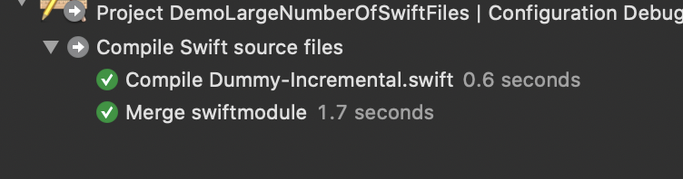
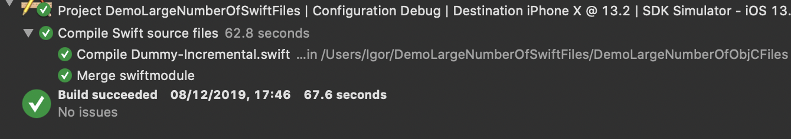

# Incremental compile of one file out of 3000 hangs Swift Compiler Driver
## Bug reproduction
* Build the project several times until the build system is happy.
* Modify `DemoLargeNumberOfSwiftFiles/Dummy-Incremental.swift`, e.g. add a newline.
* Build again (incrementally).

## Observe the build times

During the build, compile and swiftmodule take just a few seconds:

Then the build hangs and takes a lot more time. I believe this might be the driver:
